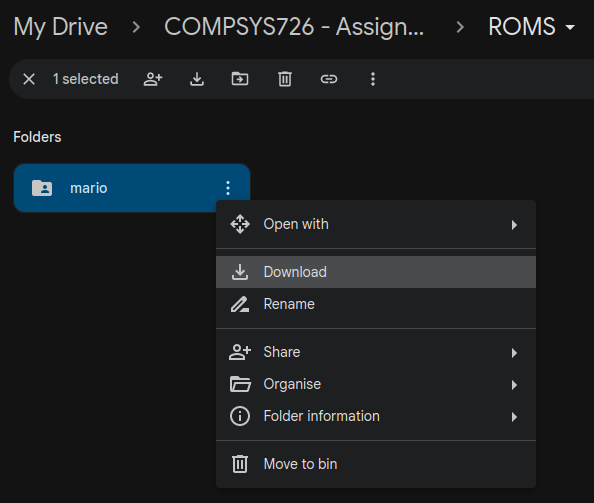
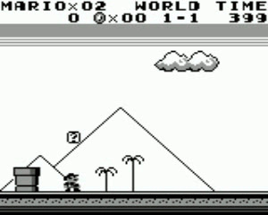
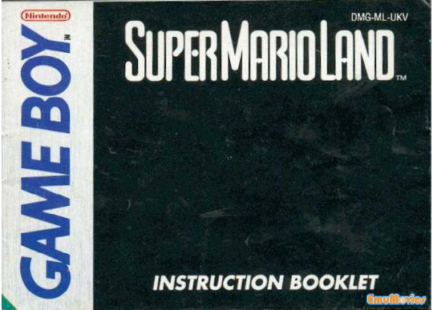
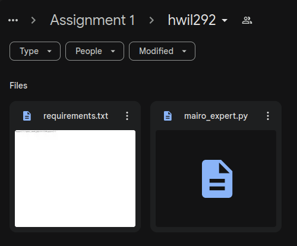

# Assignment Instructions
This document provides all the instructions to setup and run the base random agent example and then how to create your own expert agent.

## Mario
"Super Mario Land," released for the Game Boy in 1989, is a classic platformer that marked Mario's first foray onto a handheld console. Developed by Nintendo, the game features Mario on a quest to rescue Princess Daisy from the clutches of the alien Tatanga. Unlike other Mario games, "Super Mario Land" takes players through the unique worlds of Sarasaland, introducing new enemies and environments distinct from the familiar Mushroom Kingdom. The gameplay retains the core mechanics of running, jumping, and power-ups, including a new vehicle-based level where Mario pilots a submarine and an airplane. Its innovative design and portability helped solidify the Game Boy's success, making "Super Mario Land" a beloved entry in the Mario franchise.

Additional Details: https://www.mariowiki.com/Super_Mario_Land 

<p align="center">
    
</p>

## Objective
The objective of this assignment is to implement your version of "mario_expert.py" to play the game of Super Mario from the original GameBoy.
The agent must be developed as an expert system - you are free to choose how you implement the expert, using any methodology or resources online that you wish.
The only exception is you are NOT allowed to utilise Machine Learning as that is not an expert system - https://en.wikipedia.org/wiki/Expert_system.

The full details of the assignment marking and expectations of the report are laid out on Canvas: https://canvas.auckland.ac.nz/courses/104294/assignments/399077 

## Setup
Pull this package onto your computer - these instructions will default to using a folder called "~/compsys726" but you may pull these package into any directory you desire.

### Clone the Repository
`git clone` the repository into your desired directory on your local machine

```
mkdir ~/compsys726
cd ~/compsys726
git clone https://github.com/UoA-CARES/compsys726_mario_expert.git 
```

### Install Requirements
To run this package you must first install the required python packages. These packages are the base packages required to run the minimal example, you will most likely need to install additional packages to complete the assignment.

Run `pip3 install -r requirements.txt` in the **root directory** of the package.

```
cd ~/compsys726/compsys726_mario_expert
pip3 install -r requirements.txt
```

### Download ROM
Download the mario ROM folder from the link below ***(University of Auckland emails only)***.

https://drive.google.com/drive/folders/1L7W6dp5ToohZzRAuZAr3GVX-76twyBnc?usp=sharing 

<p align="center">
    <p align="center">
        
    </p>
</p>

We will then unzip and copy the downloaded files into a roms folder in the ***root directory*** of the package.

```
cd ~/Downloads
unzip mario-*.zip
cp -r mario ~/compsys726/compsys726_mario_expert/roms/mario
```

## Usage
To run this package you can simply call "run.py" in the scripts folder of the package and pass your UoA assigned upi as an arguement. The initial example agent is a random explorer who will simply randomly select actions to play the game. 

NOTE: replace ***your_upi*** with your upi

```
cd ~/compsys726/compsys726_mario_expert/scripts
python3 run.py --upi your_upi
```

You will see the game window open up and mario moving around randomly similar to the image below.

The results of the agent playing the game will be saved into ***results/your_upi/results.json*** - this will record the final game stats and a video of the agent playing the game as below: 

<p align="center">
    
</p>

```
results.json
{
    "lives": 0,
    "score": 1950,
    "coins": 5,
    "stage": 1,
    "world": 1,
    "x_position": 309,
    "time": 374,
    "dead_timer": 0,
    "dead_jump_timer": 38,
    "game_over": true,
}
```

# Implementing your Expert Agent
The agent you implement must be entirely developed within the ***scripts/mario_expert.py*** file. 
NO other file is to be edited - the automated competition system will only use your ***mario_expert.py*** file. 
This is simply to enable automated competitions between your submissions.

## Mario Expert (mario_expert.py)
You are free to modify and expand the classes inside of ***scripts/mario_expert.py*** and add additional features/functions required to implement your agent. This is not best coding practice but it makes the lecturers lives easier. 

Mario Expert contains two classes as examples of how to implement this project - MarioController, and MarioExpert

### MarioController
The MarioController class represents a controller for the Mario game environment that extends MarioEnvironment and inherits all of its functions. 

You can build upon this class all you want to implement your Mario Expert agent - this class enables you to read the game state, and take actions as Mario.

A key function to explore is how the agent interacts with the environment through ***run_action***- this function is a very basic single button press implementation.

```
def run_action(self, action: int) -> None:
    """
    This is a very basic example of how this function could be implemented

    As part of this assignment your job is to modify this function to better suit your needs

    You can change the action type to whatever you want or need just remember the base control of the game is pushing buttons
    """

    # Simply toggles the buttons being on or off for a duration of act_freq
    self.pyboy.send_input(self.valid_actions[action])

    for _ in range(self.act_freq):
        self.pyboy.tick()

    self.pyboy.send_input(self.release_button[action])
```

### MarioExpert
The MarioExpert class represents an expert agent for playing the Mario game.

Edit this class to implement the logic for the Mario Expert agent to play the game.

Do NOT edit the input parameters for the __init__, play, start_video, stop_video methods.

The key functions to explore how the agent thinks about what action to take is through ***step*** and ***choose_action** - these functions are currently a very basic random agent.

Step is run after each action by default - you need to decide which action to take and then execute it. 

```
def step(self):
    """
    Modify this function as required to implement the Mario Expert agent's logic.

    This is just a very basic example
    """

    # Choose an action - button press or other...
    action = self.choose_action()

    # Run the action on the environment
    self.environment.run_action(action)
```

Choose action shows you the type of information you can use to decide what action to take.

State contains the games statistics at the current step of the game.

Frame contains the RGB image of the game screen.

Game area is a simplified version of the game screen with the specific icon catagories instead of just RGB data.

```
def choose_action(self):
    state = self.environment.game_state()
    frame = self.environment.grab_frame()
    game_area = self.environment.game_area()

    # Implement your code here to choose the best action
    # time.sleep(0.1)
    return random.randint(0, len(self.environment.valid_actions) - 1)
```

## Mario Manual
The link below provides the physical manual with instructions on how to play Super Mario Land. This information will be super useful for developing your expert agent. For those too young to remember physical manuals these used to come with the physical cartridge and you couldn't just Google how to play. 

https://www.thegameisafootarcade.com/wp-content/uploads/2017/04/Super-Mario-Land-Game-Manual.pdf

<p align="center">
    
</p>

# Competition (Optional)
The class competition is a chance to earn ***bonus*** marks by potentially placing the top 10 furthests highest scoring agent.

Agents will be scored first based on the progression of the game - this is measured as the world the agent can get too and then the stage they made it too. If two agents have made it to the same world and stage, the score will be used to determine a winner. Ties beyond that will be given equal credit.

| **Placement** | **Bonus Marks** |
|---------------|-----------------|
| 1             | 5.0%            |
| 2             | 4.5%            |
| 3             | 4.0%            |
| 4             | 3.5%            |
| 5             | 3.0%            |
| 6             | 2.5%            |
| 7             | 2.0%            |
| 8             | 2.0%            |
| 9             | 1.5%            |
| 10            | 1.5%            |

The top placement will also win a neat trophy!

<p align="center">
    
</p>

## Agent Submission Process
To submit your agent for the class Competition you need to upload your "mario_expert.py" file and "requirements.py" by following the steps below. No other files will be utilised - the code needs to be self sufficient within "mario_expert.py" and all additional package requirements must be captured in the "requirements.txt". 

### Step 1 - Create requirements.txt
You need to create a requirements.txt that contains all the python packages you are using for your expert agent.
This can easily be generated by running 'pipreqs' in the **root directory** of the package.

```
pip3 install pipreqs
cd ~/compsys726/compsys726_mario_expert
python3 -m pipreqs.pipreqs --force
```

This will regenerate the "requirements.txt" file with your specific packages and their versions. This will enable your agent to operate as expected. 

### Step 2 - Upload Files to Google Drive
Following this link: https://drive.google.com/drive/folders/1xM3Dhtm3YCoLnMFTMxyZnhJVvHsYbFgn?usp=sharing 

Create a folder using your ***upi*** as the name. Copy your 'requirements.txt' and 'mario_expert.py' files into the folder. These files can be updated as many times as you wish until the final deadline. 

It is imperative that the files maintain their names - ***mario_expert.py*** and ***requirements.txt*** for the automted system to parse them correctly. 

This should look like the example below:

<p align="center">
    
</p>

## Competition Day
After the submission date the lecturers will run the automated competition offline - the results of the competition will be presented in class with the top 10 agents and their performance being shown.

If the automated system fails to run your code for any reason - it will be disqualified from placing. It is the students onus to make sure they follow the instructions properly to give them a chance at their agent placing in the competition. 
